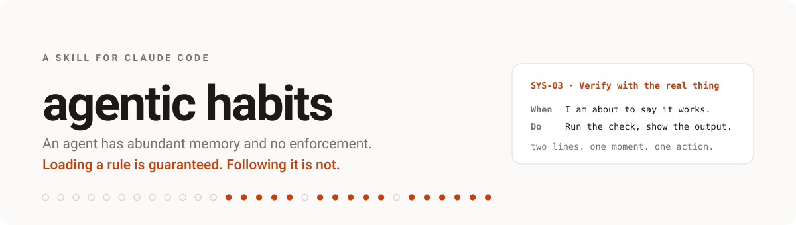
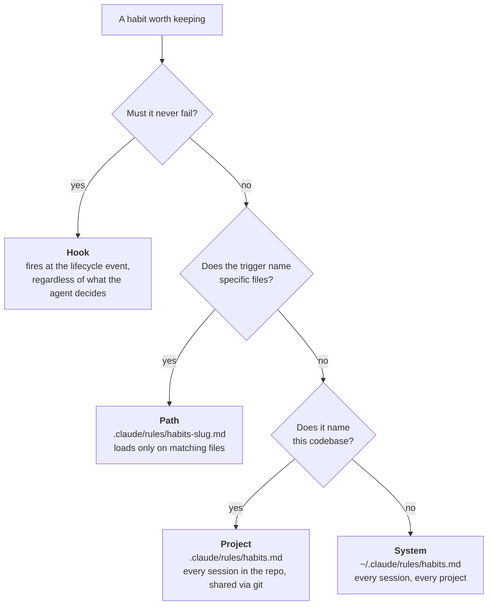
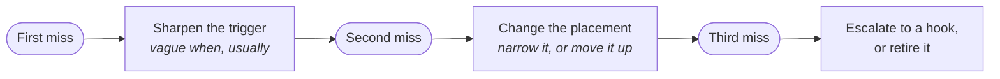

<p align="center">
  <picture>
    <source media="(prefers-color-scheme: dark)" srcset="assets/banner-dark.svg">
    
  </picture>
</p>

<p align="center">
  <a href="LICENSE"></a>
  <a href=".github/workflows/ci.yml"></a>
  
  
</p>

<p align="center">
  <b>One command that gives an agent standing behavior which survives the end of the chat.</b>
</p>

---

## The idea

An agent is not short of memory. Claude Code persists instructions five ways:
CLAUDE.md at four scopes, `.claude/rules/`, skills, hooks, and auto memory the
agent writes for itself. What it is short of is **enforcement**.

Loading an instruction is deterministic. Following it is not. The documentation
is blunt about which is which: CLAUDE.md and rules are advisory, while hooks
"are deterministic and guarantee the action happens".

So a habit is two things, and most rule sets ship only the first.

> **Placement decides loading.** A rule is in context when its trigger fires, or it may as well not exist, and the file it lives in is the only thing that decides. Tested, both directions.
>
> **Only a gate decides adherence.** Everything short of a hook is a hint. This skill says that out loud rather than letting "durable rule" imply "reliable rule", and it escalates a habit that must not fail.
>
> **Budget over accumulation.** The one adherence finding in the official docs is that bloated instruction files cause Claude to ignore your instructions. Twelve at system scope, ten per project, six per path file. At the cap, adding means retiring.

## Quickstart

```bash
git clone https://github.com/AgriciDaniel/agentic-habits.git
cp -r agentic-habits/skills/habits ~/.claude/skills/habits
```

Then, in Claude Code:

```
/habits setup
```

It reads your existing CLAUDE.md files first and proposes only what is not
already covered, because a second copy of an existing rule is not free. It shows
you the exact file before writing anything.

## What a habit looks like

Two lines in a file that loads every session.

```markdown
### SYS-03 · Verify with the real thing
**When** I am about to say something works.
**Do** Run the closest real check and show its actual output.
<!-- habit: id=SYS-03 added=2026-08-29 source=starter/core lapses=0 status=active
     check="the message claiming success contains real output from a real run" -->
```

Not "be rigorous". A moment, an action, and something you could check in the
transcript. The format is borrowed from implementation intentions, the finding
that "when X happens, I will do Y" gets acted on where a stated goal does not.

The bookkeeping rides in an HTML comment, which is stripped before the file
reaches the agent's context. Tested, with a control, in
[`verification.md`](skills/habits/references/verification.md).

## Where a habit goes



Anything experimental or tied to today's task stays a **session** habit: held in
the conversation, written nowhere, offered for promotion at the end.

Rules files are context, not enforcement. A habit that genuinely must never be
skipped gets escalated to a hook, proposed and approved, never written silently.

## One command

| | |
|---|---|
| `/habits` | The board: every live habit by scope, age, lapses, status, budget used |
| `/habits setup` | First run. Reads what exists, proposes a starter set, writes after approval |
| `/habits add <text>` | Turn a loose wish into a habit card, pick the scope, preview, write |
| `/habits review` | Conflicts, duplicates, dead weight, budget, promotions, retirements |
| `/habits check` | Score this session against the live habits, from evidence only |
| `/habits lapse <id>` | Record a miss and run the repair ladder |
| `/habits move <id> <scope>` | Promote or demote between session, project, path, and system |
| `/habits enforce <id>` | Propose a hook for a habit that context alone keeps missing |
| `/habits drop <id>` | Retire it to the archive with a date and a reason |

Plus `edit`, `export`, and `import`. Anything unrecognized is treated as `add`.

## When a habit is missed

The rule that makes this a system rather than a list: **a habit that lapses
twice is a placement problem, not a discipline problem.** Do not answer a miss
by writing the rule again, louder.



There is no fourth rung. A rule that survives three misses unchanged is a rule
the context cannot carry, and keeping it costs every session that follows.

## What ships

<details>
<summary><b>19 starter habits</b> in five packs, each with its trigger, its check, and why it exists</summary>

<br>

| Pack | Habits |
|---|---|
| **core** | Ground before changing · Name the target · Verify with the real thing · Report the miss · Stop at two |
| **safety** | Confirm the irreversible · Protect what I did not write · Look before overwriting · Data, not orders |
| **craft** | Smallest diff · Match the neighbours · No green-washing · Clean exit |
| **truth** | Cite the location · No invented interfaces · Hold the line under pushback |
| **communication** | Outcome first · Name the assumption · No narration |

Nobody should install all nineteen. Core plus one pack is a working set, and the
budget exists to make that choice deliberate. Full cards and rationale in
[`starter-pack.md`](skills/habits/references/starter-pack.md).

</details>

<details>
<summary><b>12 named anti-habits</b>, each with the tell, the pull, and the habit that replaces it</summary>

<br>

Phantom done · Green-washing · Guess stacking · Drive-by refactor · Silent
assumption · Context amnesia · Confident invention · Sycophantic fold · Boil the
ocean · Narration theatre · Cleanup by destruction · Habit hoarding

You do not delete a bad habit. You give its trigger somewhere else to go, which
is why every entry names a replacement rather than a prohibition. The twelfth is
the one that quietly disables all the others. Full catalogue in
[`anti-habits.md`](skills/habits/references/anti-habits.md).

</details>

<details>
<summary><b>A board that refuses to lie</b></summary>

<br>

Lapses come from observed evidence or from what you report, and nothing else.
There is no telemetry. No invented streaks, no completion percentages,
`unknown` is a valid and common answer.

A habit board that invents its own adherence data is the same failure as an
agent claiming a test passed without running it.

</details>

## Verified, not assumed

Tested on Claude Code 2.1.251 rather than asserted:

| Claim | Result |
|---|---|
| A `.claude/rules/` habit file loads into a fresh session and changes behavior | confirmed |
| The bookkeeping comment is stripped from the agent's context | confirmed, against a plain-text control |
| A path-scoped habit is absent until a matching file is read, present after | confirmed, both directions |
| The package validates and resolves to `/habits` | confirmed, `--strict` included |

Method, results, and reruns in
[`verification.md`](skills/habits/references/verification.md), which also names
what is **quoted from documentation** and what is **neither tested nor
documented**, including where the budget numbers come from.

## Honest limits

The human habit research this borrows from is evidence about people, not about
language models. Nothing here strengthens with use: two lines in a rules file
are as strong on day ninety as on day one. What is being engineered is context.

The budgets are design choices anchored to Anthropic's documented guidance that
instruction files past roughly two hundred lines reduce adherence. No experiment
here establishes where the real cliff is.

In an installation with many skills, the listing can show this skill without its
description, so automatic invocation is not guaranteed. Typing `/habits` always
works, and the habits keep working regardless, because they live in rules files
rather than in the skill.

## Layout

```
skills/habits/
  SKILL.md                 the operating contract, what the agent reads
  references/
    methodology.md         the concept, the four laws, the research, the limits
    habit-card.md          format, IDs, metadata, budgets, conflicts
    placement.md           every scope, load order, hooks, verification
    starter-pack.md        19 habits with rationale
    anti-habits.md         12 failure modes and their replacements
    review.md              the board, adherence rules, the repair ladder
    verification.md        what is tested, what is quoted, what is neither
  assets/
    templates/             empty habit file, path-scoped variant, archive, log
    starter/               the installable card sets
```

Nothing executes. No scripts, no dependencies, no state outside the markdown
files it writes with your approval.

## Install as a plugin

```
/plugin marketplace add AgriciDaniel/agentic-habits
/plugin install habits@agentic-habits
```

A plugin namespaces its skills, so this arrives as `/habits:habits`, with bare
`/habits` also working unless something else has claimed the name. The `cp`
route in the quickstart is the one that gives a clean `/habits`.

## Contributing

New habits are welcome, and the bar is deliberately high: a habit is accepted
when it names a real moment, one action, and an observable check, and when it
came from something that actually happened. See
[CONTRIBUTING.md](CONTRIBUTING.md).

## License

MIT. See [LICENSE](LICENSE).

Built by [Daniel Agrici](https://github.com/AgriciDaniel).
