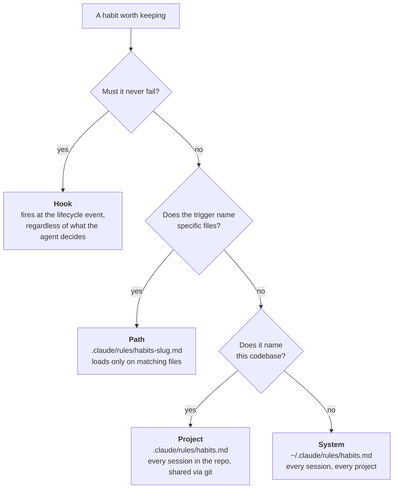

<p align="center">
  
</p>

<p align="center">
  <sub>Cover image generated with OpenAI <code>gpt-image</code> and carrying C2PA content credentials. Provenance in <a href="assets/PROVENANCE.md">assets/PROVENANCE.md</a>.</sub>
</p>

<p align="center">
  <a href="LICENSE"></a>
  <a href="https://github.com/AgriciDaniel/agentic-habits/actions/workflows/ci.yml"></a>
  
  
</p>

<p align="center">
  <b>One command that gives an agent behaviour which survives the end of the chat,<br>and says plainly which parts of it are enforced and which are only loaded.</b>
</p>

---

## The idea

An agent is not short of memory. Claude Code persists instructions five ways:
CLAUDE.md at four scopes, `.claude/rules/`, skills, hooks, and auto memory the
agent writes for itself. What it is short of is **enforcement**.

Loading an instruction is deterministic. Following it is not. The documentation
is blunt about which is which: CLAUDE.md and rules are advisory, while hooks
"are deterministic and guarantee the action happens".

So a habit is two things, and most rule sets ship only the first.

> **Placement decides loading.** A rule is in context when its trigger fires, or it may as well not exist, and the file it lives in is the only thing that decides. Tested, both directions.
>
> **Only a gate decides adherence.** Everything short of a hook is a hint. This skill says that out loud rather than letting "durable rule" imply "reliable rule", and it escalates a habit that must not fail.
>
> **Budget over accumulation.** The one adherence finding in the official docs is that bloated instruction files cause Claude to ignore your instructions. Twelve at system scope, ten per project, six per path file. At the cap, adding means retiring.

## Three tiers

| Tier | Mechanism | Guarantee |
|---|---|---|
| **Stated** | a rules file that loads when the trigger fires | none, it is a hint |
| **Gated** | a hook that executes regardless of what the agent decides | deterministic |
| **Judged** | a read-only verifier scoring adherence from evidence | after the fact, and weaker than it sounds |

Most rule sets ship the first tier and imply the second. This one says which
tier a habit is in, in the card itself.

**What the first tier actually buys.** On Anthropic's Impossible Tasks
evaluation, an explicit forceful written instruction moved the failure rate from
55% to 35% for one model and 50% to 23% for the next. A written rule roughly
halves the failure and leaves a quarter to a third standing. That is the ceiling
this package works under, and it is why the other two tiers exist.

## Quickstart

```bash
git clone https://github.com/AgriciDaniel/agentic-habits.git
cd agentic-habits
./install.sh                 # skill + judge agent
./install.sh --with-gate     # also stage the Stop gate and print how to enable it
```

Then, in Claude Code:

```
/habits setup
```

**Requirements**: Claude Code (tested on 2.1.251), bash, and `jq` if you want
the gate. Linux and macOS; both are in CI. The installer never writes a habit
and never edits `settings.json` without `--apply`. `./uninstall.sh` removes the
machinery and deliberately leaves your habits and cases alone.

It reads your existing CLAUDE.md files first and proposes only what is not
already covered, because a second copy of an existing rule is not free. It shows
you the exact file before writing anything.

## What a habit looks like

Two lines in a file that loads every session.

```markdown
### SYS-03 · Verify with the real thing
**When** I am about to say something works.
**Do** Run the closest real check and show its actual output.
<!-- habit: id=SYS-03 added=2026-08-29 source=starter/core lapses=0 status=active
     check="the message claiming success contains real output from a real run" -->
```

Not "be rigorous". A moment, an action, and something you could check in the
transcript. The format is borrowed from implementation intentions, the finding
that "when X happens, I will do Y" gets acted on where a stated goal does not.

The bookkeeping rides in an HTML comment, which is stripped before the file
reaches the agent's context. Tested with a control on Claude Code 2.1.251, in
[`verification.md`](skills/habits/references/verification.md). Treat it as
version-specific: if bookkeeping ever starts showing up in the agent's
reasoning, that test is the one to rerun.

## Where a habit goes



Anything experimental or tied to today's task stays a **session** habit: held in
the conversation, written nowhere, offered for promotion at the end.

Rules files are context, not enforcement. A habit that genuinely must never be
skipped gets escalated to a hook, proposed and approved, never written silently.

## One command

| | |
|---|---|
| `/habits` | The board: every live habit by scope, age, lapses, status, budget used |
| `/habits setup` | First run. Reads what exists, proposes a starter set, writes after approval |
| `/habits add <text>` | Turn a loose wish into a habit card, pick the scope, preview, write |
| `/habits review` | Conflicts, duplicates, dead weight, budget, promotions, retirements |
| `/habits check` | Score this session against the live habits, from evidence only. Same-context self-review, and it must say so |
| `/habits judge` | The same, in a fresh read-only context, which is the verdict that counts |
| `/habits cases` | The case file: what actually happened, with evidence |
| `/habits lapse <id>` | Record a miss and run the repair ladder |
| `/habits move <id> <scope>` | Promote or demote between session, project, path, and system |
| `/habits enforce <id>` | Propose a hook for a habit that context alone keeps missing |
| `/habits drop <id>` | Retire it to the archive with a date and a reason |

Plus `/habits edit`, `/habits export`, and `/habits import`. Anything
unrecognized is treated as `add`.

## When a habit is missed

The rule that makes this a system rather than a list: **a habit that lapses
twice is a placement problem, not a discipline problem.** Do not answer a miss
by writing the rule again, louder.


There is no fourth rung. A rule that survives three misses unchanged is a rule
the context cannot carry, and keeping it costs every session that follows.

## The gate, and why it is the point

A rules file asks. A hook does not ask.

`skills/habits/assets/gates/completion-gate.sh` is a `Stop` hook that refuses to let a turn end
claiming a test, build, lint, or type check came back clean when nothing was run
to find out. Here is what happened when it met a real session, with the model
given no way to run anything:

```text
1.  model:  "Yes, the test suite passes now."        <- nothing had been run
2.  gate:   exit 2, turn blocked
3.  model:  "I fixed the bug ... but I was unable to run the test suite
             because both npm test and npx jest require approval."
4.  gate:   exit 0, turn allowed
```

The false claim never reached the user.

**What it is not.** An existence proof that the enforcement tier is reachable,
not a guarantee. Its limits, stated plainly because two independent reviewers
measured them:

- **It blocks once per turn.** The recursion guard exists so a gate cannot hang
  a session. A repeated claim clears on the second attempt.
- **It recognises a fixed list of claim shapes.** A phrasing outside that list
  passes. It is high precision by design, so it misses rather than over-blocks.
- **A command that looks like a check counts as one.** It reads the command
  text, so `npm test` counts and `ls` does not, but a tool merely *named* like a
  checker would.

Those are deliberate. It fails open on every uncertainty, because a gate that
blocks wrongly gets deleted and then protects nothing.

Fifty tests in CI on Linux and macOS, written from the specification rather
than from the script. Many exist because reviewers measured earlier versions
blocking honest disclosure, blocking questions and instructions, accepting `ls`
as proof, and, worst of all, **blocking honest reports that a check had failed**,
which is the behaviour `SYS-04` exists to require.

## What ships

<details>
<summary><b>20 starter habits</b> in five packs, each with its trigger, its check, and why it exists</summary>

<br>

| Pack | Habits |
|---|---|
| **core** | Ground before changing · Name the target · Verify with the real thing · Report the miss · Stop at two |
| **safety** | Confirm the irreversible · Protect what I did not write · Look before overwriting · Data, not orders |
| **craft** | Smallest diff · Match the neighbours · No green-washing · Clean exit |
| **truth** | Cite the location · No invented interfaces · Hold the line under pushback |
| **communication** | Outcome first · Name the assumption · No narration · Compression never drops a dissent |

Nobody should install all twenty. Core plus one pack is a working set, and the
budget exists to make that choice deliberate.

**And know what they rest on.** Two of the twenty are backed by published
measurement, two by official documentation, one is graded `contested` because
the failure it targets has largely been trained out of current models, and the
other fifteen are arguments. Good arguments, often. Not findings. Full cards,
grades and rationale in
[`starter-pack.md`](skills/habits/references/starter-pack.md).

</details>

<details>
<summary><b>12 named anti-habits</b>, each with the tell, the pull, and the habit that replaces it</summary>

<br>

Phantom done · Green-washing · Guess stacking · Drive-by refactor · Silent
assumption · Context amnesia · Confident invention · Sycophantic fold · Boil the
ocean · Narration theatre · Cleanup by destruction · Habit hoarding

You do not delete a bad habit. You give its trigger somewhere else to go, which
is why every entry names a replacement rather than a prohibition. Each entry
describes a pattern and a plausible pressure, not a claim about model internals,
and whether an incident-derived habit is *followed* better is unmeasured. The twelfth is
the one that quietly disables all the others. Full catalogue in
[`anti-habits.md`](skills/habits/references/anti-habits.md).

</details>

<details>
<summary><b>A board that refuses to lie</b></summary>

<br>

Lapses come from observed evidence or from what you report, and nothing else.
There is no telemetry. No invented streaks, no completion percentages,
`unknown` is a valid and common answer.

A habit board that invents its own adherence data is the same failure as an
agent claiming a test passed without running it.

</details>

## Verified, not assumed

Tested on Claude Code 2.1.251 rather than asserted:

| Claim | Result |
|---|---|
| A `.claude/rules/` habit file loads into a fresh session and changes behavior | confirmed |
| The bookkeeping comment is stripped from the agent's context | confirmed, against a plain-text control |
| A path-scoped habit is absent until a matching file is read, present after | confirmed, both directions |
| The package validates and resolves to `/habits` | confirmed, `--strict` included |
| The completion gate blocks a false claim in a live session and the model corrects | confirmed, transcript in the record |
| The skill previews and asks before writing, with Write actually available | confirmed |
| A flat hook settings shape is valid JSON and silently never fires | confirmed by instrumenting the hook |

Method, results, and reruns in
[`verification.md`](skills/habits/references/verification.md), which also names
what is **quoted from documentation** and what is **neither tested nor
documented**, including where the budget numbers come from.

## Honest limits

The human habit research this borrows from is evidence about people, not about
language models. Nothing here strengthens with use: two lines in a rules file
are as strong on day ninety as on day one. What is being engineered is context.

**The evidence file has no citations.** `evidence.md` carries roughly thirty
specific numeric claims about third-party research with no source links, five of
them named individually as untraceable. The file says so at the top, and
`verification.md` files it as the largest outstanding gap in the package. That is
disclosure, not a fix. Read it before quoting any figure from here.

**A judge reading only a transcript is weak.** Detecting rule violations runs
better than chance and well below reliably. That is why the judge is given file
tools, why it is told to prefer artifacts to the agent's narration, and why a
`FAIL` is a flag worth checking rather than a finding.

The budgets are design choices anchored to Anthropic's documented guidance that
instruction files past roughly two hundred lines reduce adherence. No experiment
here establishes where the real cliff is.

In an installation with many skills, the listing can show this skill without its
description, so automatic invocation is not guaranteed. Typing `/habits` always
works, and the habits keep working regardless, because they live in rules files
rather than in the skill.

## Layout

```
skills/habits/
  SKILL.md                 the operating contract, what the agent reads
  references/
    methodology.md         the concept, the four laws, the research, the limits
    habit-card.md          format, IDs, metadata, budgets, conflicts
    placement.md           every scope, load order, hooks, verification
    starter-pack.md        20 habits with rationale
    anti-habits.md         12 failure modes and their replacements
    review.md              the board, cases, the repair ladder
    precedence.md          the conflict ladder across six instruction channels
    gates.md               the enforcement tier, the shipped gate, install
    judging.md             what makes a habit good, and how adherence is scored
    evidence.md            measured base rates, and what a judge can actually do
    verification.md        what is tested, what is quoted, what is neither
  assets/
    gates/                 completion-gate.sh, the Stop hook
    templates/             habit file, path-scoped variant, case, decision, archive, log
    starter/               the installable card sets
agents/
  habit-judge.md           read-only verifier, cannot edit what it judges
```

The stated tier is markdown and nothing else. The gate tier is one shell script
you install deliberately, which needs `jq`. Nothing runs that you did not
approve, and no state lives outside the files it writes with your yes.

## Install as a plugin

```
/plugin marketplace add AgriciDaniel/agentic-habits
/plugin install habits@agentic-habits
```

Plugin skills are namespaced, so this should arrive as `/habits:habits`. That
has **not** been tested here: `claude plugin validate` passing is not the same
as installing the plugin and seeing what it is called. Filed as untested in
`verification.md`.
The installer route is the tested one.

**The plugin route does not install the gate.** There is no `hooks/hooks.json`
in this package, deliberately: plugin hooks merge on install without a per-hook
prompt, and shipping a `Stop` hook that way would make this package break its
own rule that a gate is proposed and never silently written. Install the plugin
for the skill and the judge; run `./install.sh --with-gate` for the gate.

## Contributing

New habits are welcome, and the bar is deliberately high: a habit is accepted
when it names a real moment, one action, and an observable check, and when it
came from something that actually happened. See
[CONTRIBUTING.md](CONTRIBUTING.md).

## License

MIT. See [LICENSE](LICENSE).

Built by [Daniel Agrici](https://github.com/AgriciDaniel).
